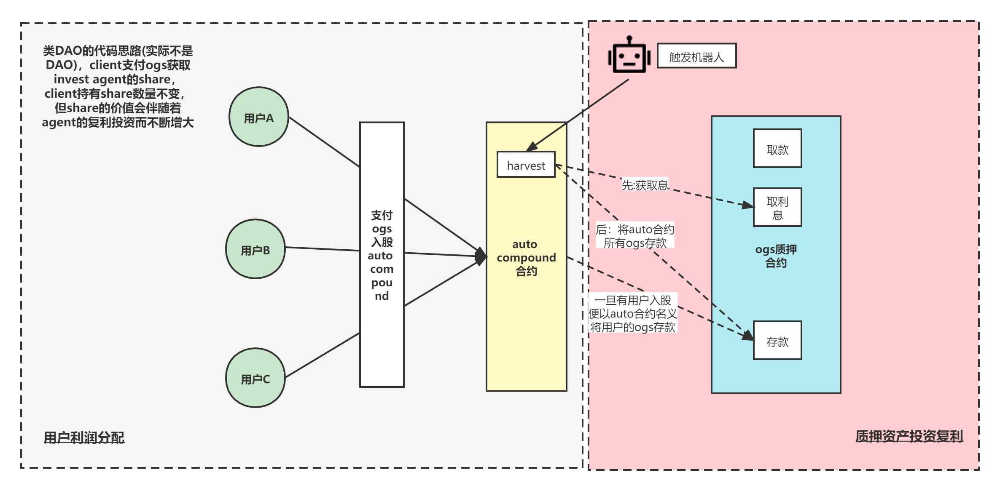

# Ouro Auto Compound

#### 第二版介绍（采用与pancake完全相同的auto compound解决方案）
1. 将质押资产投资复利与用户利润分配的代码逻辑区分开

2. lp_stacking.sol 部署ogs质押池, auto_ogs.sol链接该质押池

3. 仅新增Auto_ogs.sol，[library.sol，lp_stacking.sol，ogs.sol都沿用Ouro源码仓库中的代码]

   

   ​                                                                                        **图1 第二版整体思路(采用pancake auto compound实现思路)**

4. 第二版的整体思想如图1所示，参考pancake auto compound的模式，auto_ogs.sol的作用相当于一个investment agent，参与auto compound的用户相当于client

   **质押资产投资复利：**agent收取client的ogs，将client的ogs整合在一起，以agent的名义质押到ogs质押池中，并定期(需要机器人定期触发auto_ogs.sol中的harvest函数) 进行复投 (compound)

   **用户利润分配：**agent 在收取client的ogs时，会分配给客户share以记账client，每个client持有的share数量仅在client再次参与auto pool投资给agent ogs时才会增加，否则client持有的share数量恒定不变，这里的share可以理解为把agent的投资本息依据当前share总量平均分块，client参与时是兑换当前时刻agent投资本息依据当前share总量平均分块价值的share数量，client在取款时用户的可支配share数量不变，但share的价值已经发生变化，当前share价值计算公式如下(对应auto_ogs.sol中getOgsPerAgentShare()接口)：

   OgsPerAgentShare = balanceOfAgentInvestment / totalShareNum

5.  具体的代码逻辑都阐述在Auto_ogs.sol的注释中

   

