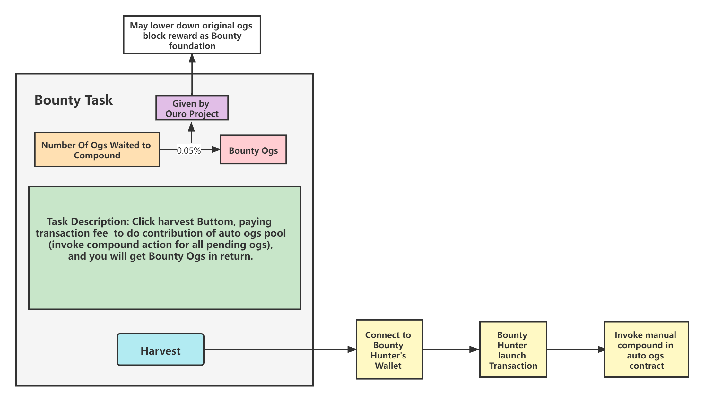

#### compound触发机制介绍

- 设立一个激励机制让社区用户去帮忙触发 compound （**注意: 帮忙触发compound的用户不一定是参与质押的用户，该用户可理解为Bounty Hunter**)

**Bounty:**

<u>即实时展示当前auto ogs pool 中待compound的ogs数量M，将*0.05%*M等额的ogs作为Bounty (由 Ouro Project提供Bounty基金支持)</u>

*可将auto ogs中的block reward调低，把其中一部分block reward拿来作为Bounty 基金

**Bounty任务：**

<u>Bounty任务为用户发起交易，唤醒auto ogs合约中的harvest函数，并支付交易的手续费</u>

**Incentive:**

<u>当Bounty的数额积累到其价值超过Bounty任务的成本时，便会有Bounty Hunter来完成该任务</u>
